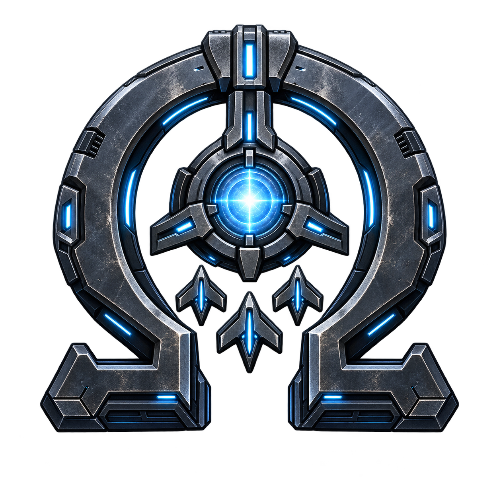

# Omega AI



Omega AI 0.2.1 is a local development build for Starsector 0.98a-RC8.
It controls target selection, hull facing, and movement for ordinary combat ships.
Combat effectiveness has not yet been established in game.

Enable Omega AI is one Yes/No switch and defaults to Yes. The old Observe/Coordinate selector is removed.
When enabled, Omega closes to effective weapon range, maintains that range, withdraws under unsafe pressure, waits for delayed heavy support, and pursues reachable vulnerable targets.
Ships share target allocation and stop chasing enemies that are opening range faster than they can intercept.
No restores the previous pilots. Saved Observe selections from older builds no longer disable enabled control.

One small label appears above each ship while its Omega pilot executes a movement decision:
Advancing, Engaging, Pursuing, Retreating, Waiting for support, or Disengaging.
Retreating means withdrawing from local danger, not leaving the battle.
Labels disappear when control passes to another controller or the decision expires.
The upper-left combat HUD counts ships under Omega control and explains why a fleet has no active ships.
Logging is optional and starts disabled.

## Install

Requires Starsector 0.98a-RC8, LunaLib 2.0.0 or later, and LazyLib.
Install `Omega-AI-0.2.1.zip` through your mod manager and leave Enable Omega AI set to Yes in LunaLib.
The included Omega AI: Fleet Trial mission is available from the mission list.
Use autopilot if you want Omega to control the flagship too.

## Current limits

The native game modules still handle weapons, missile firing, shields, venting, ship systems, and emergency collision avoidance.
This build does not implement new missile doctrine, shield decisions, carrier wing coordination, or encirclement tactics.
Carriers, phase ships, fighters, stations, allied fleets, and custom ship AI retain their existing control.

Specific player or commander assignments take precedence. Search and Destroy permits autonomous Omega control.
Full Assault, Full Retreat, Avoid, and Ignore directives defer to native control.
An enemy fleet in full retreat also returns pursuit to the native pilot.
Active systems, venting, overload, manual control, and RTSAssist control markers suspend Omega steering.

Earlier Omega AI blocks control. AI Tweaks replaces ordinary pilots even when its Custom AI option is off.
RTSAssist wraps friendly pilots automatically. Both controllers remain unsupported and can prevent all Omega control.
The HUD identifies these conflicts by name. For the first gameplay test, enable only Omega AI, LunaLib, and LazyLib.
Restart the game, open Fleet Trial, enable flagship autopilot, and give your fleet Search & Destroy.
Read the [test instructions](docs/TESTING.md) for the expected behavior and control-switch check.
The direct helm uses RC8 game internals and disables itself on an unsupported version.
Compatibility with every combat mod is not established.

## Build

Use JDK 17 or later and Python 3.10 or later on Windows.
Set `starsectorPath=D:/Games/StarSector` in an untracked `local.properties`, or set `STARSECTOR_HOME`.
The game installation supplies the game, LunaLib, LazyLib, and native test libraries.

```powershell
.\gradlew.bat clean build --console=plain
python -m unittest discover -s tests -p "test_package.py"
python package.py
python package.py --verify Omega-AI-0.2.1.zip
```

The script stages runtime files in `OmegaAI/` and writes the ZIP in this project's root.
Both outputs are gitignored. The ZIP contains one top-level `OmegaAI/` folder with metadata, the compiled JAR, icons, and mission resources.
It excludes source, tests, development documents, and third-party libraries.
Packaging verifies source and class fingerprints, version metadata, tests, resources, and archive layout.
It never installs into the game.

See the [design](docs/DESIGN.md), [verification record](docs/TESTING.md), [changelog](CHANGELOG.md), and [art record](docs/ART.md).
The [forum post](docs/FORUM-POST.txt) remains an unpublished draft for the last public build.
The public version tracker stays at 0.1.1; the ZIP contains local version 0.2.1 while retaining the last published download URL.
No new tags or GitHub Releases will be created before the joint decision to release 1.0.0.
